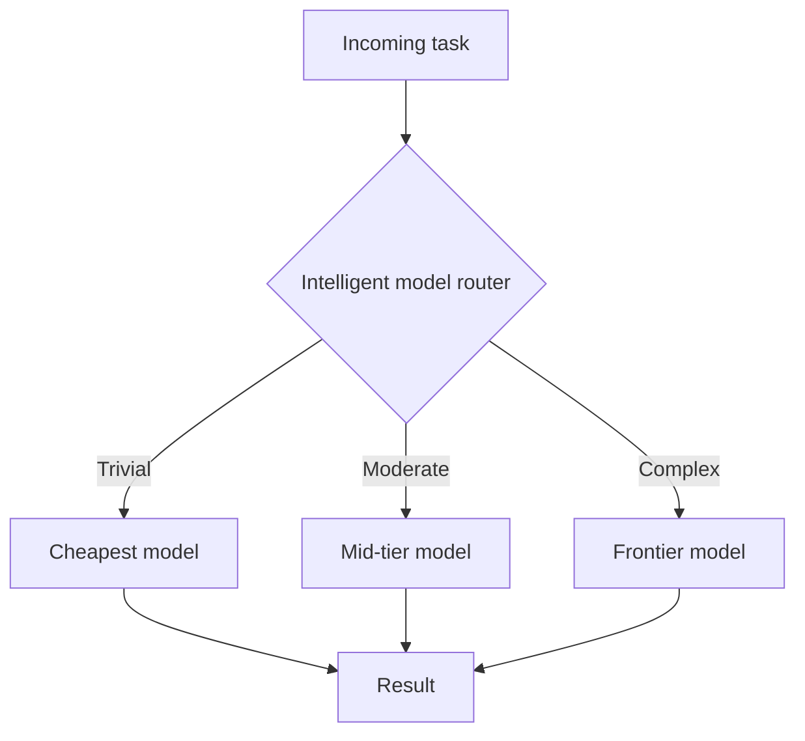
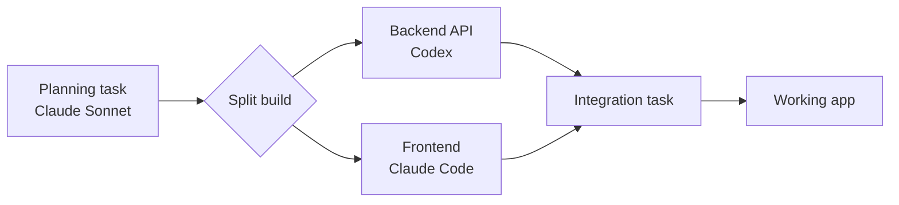
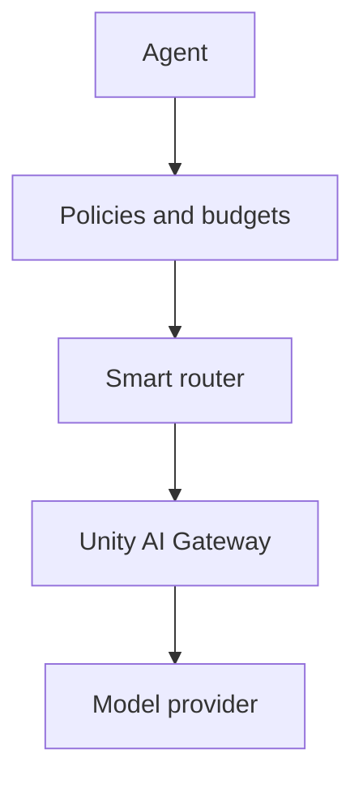

# How do you route each coding task to the lowest cost capable model?

*Last updated: August 27, 2026*

Smart routing evaluates every task in a session separately and sends it to the lowest cost model that is capable of completing it. In Omnigent, an open source meta harness that lets different agents share context, you enable this with the intelligent model router. The router classifies each task, selects a model, and shows its reasoning on screen. Omnigent runs on its own, and it is also available hosted on Databricks, where model calls route through Unity AI Gateway and usage lands in system tables.

**Watch the video:** <!-- GAP: video 1 URL -->

**Lesson 1 of 10** in the Agentic AI Explained series.

---

## What this solves

Most people default to a frontier model for every coding task. It works, and it produces good results. The cost is that planning, backend code, frontend code, test generation, formatting, and short follow-up questions all get billed at the same rate and all wait on the same latency profile.

Those tasks are not equally difficult. A multi-file architectural decision and a request for a Slack status template consume very different amounts of reasoning. When one model handles both, the second one is overpaid for.

Hard-coding a model name into an application creates a second problem. Model versions change frequently. Every change means editing the application.

Smart routing moves the model decision out of the application and into the runtime. The agent breaks the work down, evaluates each task on its own, and picks a model per task.

---

## How the router decides

The intelligent model router sits between the agent and the available models. For each task it evaluates signals such as:

- task complexity and expected reasoning depth
- whether the task requires analysis or pattern completion
- the capability floor needed to produce a correct result
- cost and latency of the candidate models
- model availability

It then writes a short reasoning line explaining the selection. That line is visible in the session, which is what makes the behavior verifiable. When the router picks something unexpected, you can read why.

Two properties are worth knowing before you demo this:

The router decides at agent start. Follow-up messages inside the same session keep the model that was already selected, and no new routing chip appears. To see a different routing decision, start a new session.

The router toggle is per session. It resets on the home screen, so it has to be enabled before each new session.

---

## What happened in the demo

I asked Omnigent to build a simple application that converts Celsius to Fahrenheit. I selected Polly, the agent designed for multi-agent coding, and turned on smart routing.

The router handled the request in four stages.

| Stage | Task | Classification | Model selected |
|---|---|---|---|
| 1 | Plan the application | Moderate | Claude Sonnet |
| 2 | Build the backend API | Split from the build task | Codex |
| 3 | Build the frontend | Split from the build task | Claude Code |
| 4 | Integrate the two halves | Follow-up task | <!-- GAP: model for the integration step was not stated in the video --> |

The first decision was the planning task, classified as moderate, which went to Claude Sonnet. The router then split the actual build into two separate tasks. The backend API went to Codex. The frontend went to Claude Code. Both agents launched in parallel, and the orchestrator waited for them to finish. Once both returned, it created another task to bring everything together.

I did not choose a model at any point in that sequence.

---

## Why the parallel step matters

Splitting the build into two tasks does more than change which model is billed. Because the backend and the frontend have no dependency on each other, both agents run at the same time on different parts of the same application.

This is where the meta harness part of Omnigent matters. Codex and Claude Code are separate harnesses from separate vendors. They share context through Omnigent, which is what allows the integration step to reconcile two independently produced halves.

Omnigent supports eleven harnesses in the agent picker today, including Claude Code, Codex, OpenCode, Cursor, Pi, Antigravity, Kiro, Qwen Code, and Kimi, plus the multi-agent agents Polly for coding and Debby for debate, plus custom agents.

---

## How much does routing actually change the cost?

The routing decision is per task, and the size of the saving depends on how much of a session is made up of light work.

A useful pair to compare is a hard task and a trivial task run through the same router:

| Request | Router reasoning | Model |
|---|---|---|
| Pressure-test a product feature across multiple stakeholder perspectives | Requires deep product analysis and multi-stakeholder perspective simulation | Claude Sonnet |
| Give me a one-line status update template I can paste in Slack | Simple template creation task requires minimal capability, so using the cheapest Claude model | Claude Haiku |

Both went through the same router with no configuration change between them. The cost control happens at runtime with no policy document and no developer decision.

For exact spend, the session cost is visible live in the Omnigent policies panel, and every model call made through hosted Omnigent on Databricks routes through Unity AI Gateway and is recorded in `system.ai_gateway.usage`. Guide 3 covers how to query that.

---

## What smart routing does not cover

Routing answers which model should handle a task. It does not answer:

- whether this user is allowed to access that model
- whether the agent is allowed to execute a given tool
- whether a human should approve an action before it runs
- whether a user or team has exceeded a budget
- what the request cost and where the trace is

Those controls belong to the policy layer and the gateway layer. Guide 2 covers policies. Guide 3 covers Unity AI Gateway.

---

## What to watch out for

**The router toggle resets per session.** If no routing chip appears above the first response, the toggle was not enabled. The session still works, and no routing happens.

**Routing is decided once per session start.** Do not expect a downshift partway through a long session. Start a fresh session to see a new decision.

**The router will sometimes pick a model you did not expect.** Read the reasoning line. It is usually defensible, and it confirms the decision is being made at runtime.

**Hosted Omnigent on Databricks is in Beta**, and the contextual policy engine is open source in alpha. Verify current status in the official documentation before depending on this in production.

**Sandbox launch can be transient.** A "runner did not come online" message happens occasionally. Retry or start a fresh session.

---

## Try it

Omnigent is open source. Start at [omnigent.ai](https://omnigent.ai).

1. Open Omnigent and select Polly from the agent picker.
2. Click the intelligent model router icon to the right of the chat input, and confirm it shows as pressed.
3. Ask it to build something small with a clear frontend and backend split.
4. Watch the routing chip above each response and read the reasoning line.
5. Open a new session, enable the router again, and send a trivial request to see the downshift.

---

## Related guides

- [Policies for agent behavior and spend](./02-agent-policies.md)
- [Unity AI Gateway](./03-unity-ai-gateway.md)

---

[Next: Policies for agent behavior and spend →](./02-agent-policies.md)
