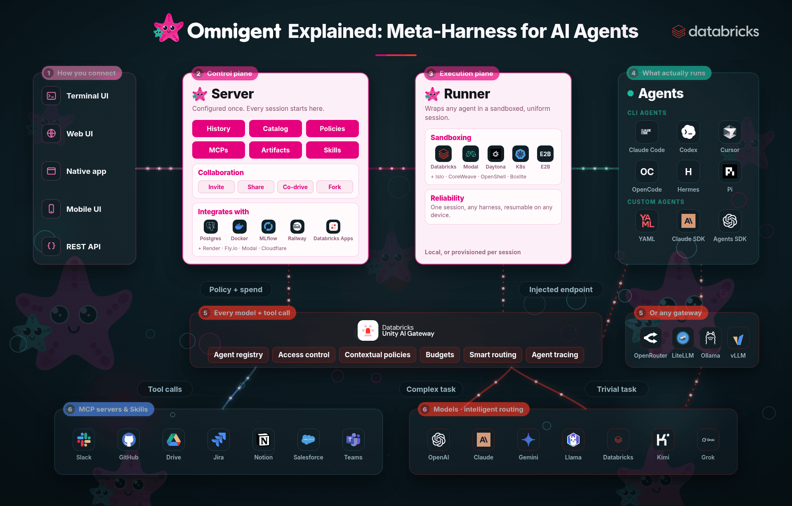

# 🧭 Lesson 1: How do you route each coding task to the lowest-cost capable model?

*Part of the **Agentic AI Explained** series · Lesson 1 of 10 · Last updated: August 27, 2026*

Smart routing evaluates every task in a session separately and sends it to the **lowest-cost model capable of completing it**. In Omnigent, an open-source meta harness that lets different agents share context, you turn this on with the intelligent model router. The router classifies each task, picks a model, and shows its reasoning on screen. Omnigent runs on its own and is also available hosted on Databricks, where model calls route through Unity AI Gateway and usage lands in system tables.

  

---

## 🎯 What this solves

Most people default to a frontier model for every coding task. It works, and the results are good — but it can be **slower and more expensive than the task needs.** Planning, backend code, frontend code, test generation, formatting, and short follow-up questions all get billed at the same rate and all wait on the same latency profile.

Those tasks are not equally difficult. A multi-file architectural decision and a request for a Slack status template consume very different amounts of reasoning. When one model handles both, the second one is overpaid for.

Hard-coding a model name into an application creates a second problem. Model versions change frequently, and every change means editing the application.

Smart routing moves the model decision **out of the application and into the runtime.** The agent breaks the work down, evaluates each task on its own, and picks a model per task.

---

## 🤖 What is Omnigent?

Every lab in this series runs on **Omnigent**, so it is worth one paragraph on what it is.

Omnigent is an **open-source meta harness**: a layer that sits above individual coding agents and lets them share one context, one access-control surface, and one policy engine. Instead of committing to a single vendor's agent, you pick the right harness for each job and let them collaborate.

- 🧩 **Eleven harnesses in the agent picker today**, including Claude Code, Codex, OpenCode, Cursor, Pi, Antigravity, Kiro, Qwen Code, and Kimi.
- 👥 **Multi-agent agents** — Polly for coding and Debby for debate — plus your own custom agents.
- 🔗 **A shared context layer** so agents from different vendors can hand work to each other.
- 🛡️ **A runtime policy engine** (the subject of [Lesson 2](./02-agent-policies.md)) that governs every tool call, regardless of which harness makes it.

That "meta" property is what makes the parallel step later in this lesson possible: Codex and Claude Code are separate harnesses from separate vendors, and Omnigent is what lets them build two halves of one application and then reconcile them.

Omnigent is open source at [omnigent.ai](https://omnigent.ai). It runs on its own, and it is also available **hosted on Databricks (Beta)**, where every model call routes through Unity AI Gateway and lands in system tables — the topic of [Lesson 3](./03-unity-ai-gateway.md).

---

## 🧠 How the router decides

The **intelligent model router** sits between the agent and the available models. For each task it evaluates signals such as:

- task complexity and expected reasoning depth
- whether the task needs analysis or pattern completion
- the capability floor required for a correct result
- cost and latency of the candidate models
- model availability

It then writes a short **reasoning line** explaining the selection. That line is visible in the session, which is what makes the behavior verifiable. When the router picks something unexpected, you can read why.

> ⚠️ **Two properties matter before you demo this.** The router decides at agent start, so follow-up messages inside the same session keep the model that was already selected and no new routing chip appears. To see a different routing decision, start a new session. The router toggle is also per session and resets on the home screen, so enable it before each new session.

---

## 🎬 What happened in the demo

I asked Omnigent to build a simple application that converts Celsius to Fahrenheit. I selected **Polly**, the agent designed for multi-agent coding, and turned on smart routing.

| Stage | Task | Classification | Model selected |
|---|---|---|---|
| 1 | Plan the application | Moderate | Claude Sonnet |
| 2 | Build the backend API | Split from the build task | Codex |
| 3 | Build the frontend | Split from the build task | Claude Code |
| 4 | Integrate the two halves | Follow-up task | <!-- GAP: model for the integration step was not stated in the video --> |

The first decision was the planning task, classified as **moderate**, which went to **Claude Sonnet**. The router then split the build into two separate tasks. The backend API went to **Codex**, the frontend went to **Claude Code**. Both agents launched in parallel and the orchestrator waited for them to finish. Once both returned, it created another task to bring everything together.

**I did not choose a model at any point in that sequence.**

---

## ⚡ Why the parallel step matters

Splitting the build into two tasks does more than change which model is billed. The backend and the frontend have no dependency on each other, so **both agents run at the same time** on different parts of the same application.

This is where the meta harness part of Omnigent matters. Codex and Claude Code are separate harnesses from separate vendors. They share context through Omnigent, which is what lets the integration step reconcile two independently produced halves.

---

## 💸 How much does routing change the cost?

The routing decision is per task, so the size of the saving depends on how much of a session is light work.

| Request | Router reasoning | Model |
|---|---|---|
| Pressure-test a product feature across several stakeholder perspectives | Requires deep product analysis and multi-stakeholder perspective simulation | Claude Sonnet |
| Give me a one-line status update template I can paste in Slack | Simple template creation task requires minimal capability, so using the cheapest Claude model | Claude Haiku |

Both went through the same router with no configuration change between them. The cost control happens **at runtime**, with no policy document and no developer decision.

Session cost is visible live in the Omnigent policies panel. Every model call made through hosted Omnigent on Databricks routes through Unity AI Gateway and is recorded in `system.ai_gateway.usage`. [Lesson 3](./03-unity-ai-gateway.md) covers how to query that.

---

## 🚧 What smart routing does not cover

Routing answers *which model handles a task.* It does not answer:

- whether this user may access that model
- whether the agent may execute a given tool
- whether a human should approve an action before it runs
- whether a user or team has exceeded a budget
- what the request cost and where the trace is

Those controls belong to the policy layer and the gateway layer. [Lesson 2](./02-agent-policies.md) covers policies. [Lesson 3](./03-unity-ai-gateway.md) covers Unity AI Gateway.

---

## 🧪 Your lab

Omnigent is open source, and this whole lab costs only cents in model calls — the converter is deliberately tiny. Start at [omnigent.ai](https://omnigent.ai).

**Part 1 — watch the router reach for a capable model**

1. Open Omnigent. You should land on *"What should we do?"*.
2. In the **agent picker**, select **Polly** (multi-agent coding). Keep the default orchestrator.
3. Click the **intelligent model router** icon just to the right of the chat input, and confirm it shows as **pressed**. This toggle resets on every new session, so it is easy to miss.
4. Paste a small build with a clear front/back split:
   > Build a simple app that converts Celsius to Fahrenheit.
5. **What you'll see:** a routing chip above the response — for example *Intelligent model router · sonnet* — with a one-line reason. As the build splits, the backend and frontend tasks route to different models and run in parallel.

**Part 2 — watch it downshift on a trivial ask**

6. Open a **new session**, then click the router icon again (it reset).
7. Paste something trivial:
   > Give me a one-line status update template I can paste in Slack.
8. **What you'll see:** the router picks the cheapest model — for example *Intelligent model router · haiku* — with a reason like *"simple template creation task requires minimal capability."* Same router, a fraction of the cost.

> 💡 No routing chip on your first response means the toggle was not enabled. Start a fresh session and click it before sending.

## 🏆 Your challenge

Run the same build twice — once with the router off and once with it on — and record the session cost from the policies panel for each. Then write down the tasks where you disagree with the router's choice and what the reasoning line said. **That list is the useful artifact:** it tells you where routing is worth trusting on your workload and where it is not.

---

## 👀 What to watch out for

- **The router toggle resets per session.** No routing chip above the first response means the toggle was not enabled. The session still works, and no routing happens.
- **Routing is decided once at session start.** Do not expect a downshift partway through a long session. Start a fresh session for a new decision.
- **The router will sometimes pick a model you did not expect.** Read the reasoning line. It is usually defensible, and it confirms the decision is being made at runtime.
- **Hosted Omnigent on Databricks is in Beta**, and the contextual policy engine is open source in alpha. Check current status in the official documentation before depending on this in production.
- **Sandbox launch can be transient.** A "runner did not come online" message happens occasionally. Retry or start a fresh session.

---

## 🔗 Related lessons

- [Lesson 2: Agent policies and budgets](./02-agent-policies.md)
- [Lesson 3: Unity AI Gateway](./03-unity-ai-gateway.md)

---

[Next: Agent policies and budgets →](./02-agent-policies.md)
