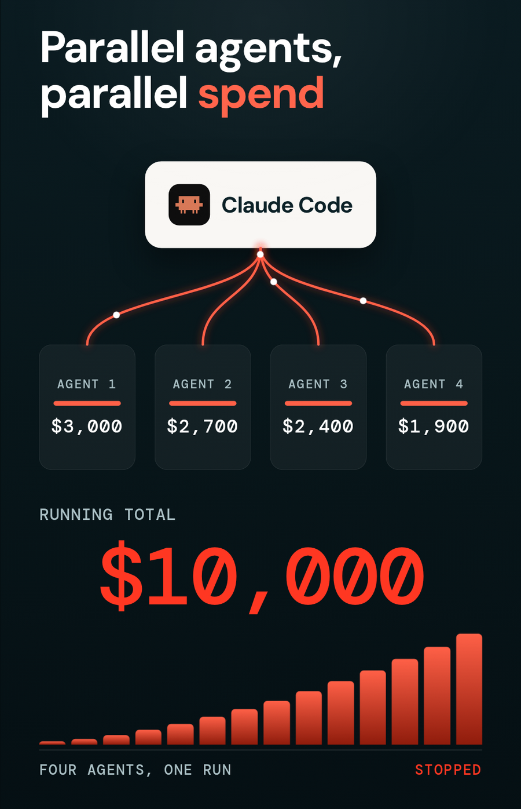

# Lesson 2: How do you stop an AI agent from overspending or taking unsafe actions?

*Last updated: August 27, 2026*

You define policies that sit between the agent and the tools or systems it wants to reach. Before the agent acts, the policy layer evaluates the action and returns one of three verdicts: allow, ask for human approval, or deny. Some policies control cost, with soft checkpoints under a hard limit. Others control behavior, such as repeated tool calls or shell commands. In Omnigent these are evaluated in the runtime on every tool call, so they hold for any agent harness in the session.

**Watch:** <!-- GAP: video 2 URL --> · **Lesson 2 of 10** in Agentic AI Explained

<p align="center">
  
</p>

---

## What this solves

Traditional access control asks whether a user may reach a resource. Agent systems add a second question: what the agent is allowed to do with that resource once it has it.

An agent may hold legitimate permission to read a customer record. That permission says nothing about whether it should publish that record, send it to an external system, delete a file, run a shell command, commit code, or spend without limit on model calls.

Two failure modes show up quickly in real sessions.

The first is cost, and parallelism makes it sharper. An agent that dispatches four sub-agents is running four bills at once, and a retry loop in any one of them keeps calling a model until somebody notices.

The second is action risk. A single shell command is usually harmless. A long sequence of shell commands in one session is a different situation, and evaluating each command on its own misses that.

---

## The policy layer

The check happens while the agent is operating, before the action executes. Policies can also evaluate responses after a call returns.

| Verdict | What happens |
|---|---|
| ALLOW | The action executes automatically |
| ASK | Execution pauses until a human approves or rejects |
| DENY | The action is blocked |

Omnigent ships more than 20 runtime policies covering cost budgets, PII scanning, dangerous command blocking, and intent gating. Custom policies add organization-specific logic.

These are policies, not prompts. They are evaluated server side in the Omnigent runtime on every tool call, for any harness in the session. An agent that has been prompt injected cannot talk its way past them, because the rule does not live in the prompt.

---

## Setting up a spend budget

I start by selecting which MCP servers the agent may reach, which fixes the surface area before any policy applies. Then I define the policies.

For a small application build, I set a hard limit of $10 with soft limits at $2, $5, and $7.

| Threshold | Type | Behavior |
|---|---|---|
| $2 | Soft | Agent pauses and asks permission to continue |
| $5 | Soft | Agent pauses and asks again |
| $7 | Soft | Agent pauses and asks again |
| $10 | Hard | Execution stops |

The soft limits are the useful part. Each pause is a checkpoint where I look at what the agent has actually done for the money. A retry loop shows up there. A model that is the wrong choice for the task shows up there. Session cost and token usage are visible live in the agent tools and policies panel, so I can watch the number move without waiting for a checkpoint.

---

## Limiting repeated tool calls

Spend limits catch a runaway loop eventually. A tool call limit catches it earlier and more precisely.

I can cap how many times the agent may use a specific tool in a session. An agent that keeps retrying the same operation gets stopped at the cap. The cap is about the pattern, so it does not require me to predict which specific operation will go wrong.

---

## Contextual policies: the session risk score

The session risk score is a policy with memory. Each guarded tool call adds points to a running session total. Below the threshold, actions execute normally. Once the total crosses the threshold, the next guarded action requires approval.

```json
{
  "tool_points": {
    "Bash": 30,
    "sys_os_shell": 30
  },
  "guarded_tools": [
    "Bash",
    "sys_os_shell"
  ],
  "threshold": 50,
  "action": "ASK",
  "reason": "Session risk threshold reached, shell commands now require human approval"
}
```

Both shell aliases are listed because different harnesses expose shell under different names. `sys_os_shell` covers the Omnigent multi-agent orchestrator, and `Bash` covers Claude Code.

### What this looks like in a session

I ask the agent to run three harmless shell commands, one at a time, each as its own tool call.

| Order | Command | Score before | Score after | Verdict |
|---|---|---|---|---|
| 1 | `whoami` | 0 | 30 | Allowed |
| 2 | `date` | 30 | 60 | Allowed |
| 3 | `ls /tmp` | 60 | 60 | Held for approval |

The third command is held with the message that session risk score 60 is at or above threshold 50, and shell commands now require review. The full tool payload appears with approve and reject buttons.

Nothing about the third command is more dangerous than the first two. What changed is what the agent had already done in that session. This is the behavior a per-action rule cannot produce.

The practical value shows on both sides. Gating every command produces approval fatigue and people start clicking approve without reading. Gating nothing produces blind trust. A threshold puts the human in the loop at the point where the session has accumulated enough activity to be worth a look.

---

## Which policies belong to security and which to operations

Agent governance covers both, using the same mechanism.

| Category | Examples |
|---|---|
| Cost | Spend per user, per agent, per application; hard caps; rate limits |
| Behavior | Tool call limits, model allowlists, restrictions on external endpoints |
| Safety | PII scanning, dangerous command blocking, unsafe content, prompt injection detection |
| Approval | Human approval before destructive actions, session risk thresholds |

---

## Your lab

Omnigent is open source. Start at [omnigent.ai](https://omnigent.ai).

1. Start a session and open agent tools and policies.
2. Select which MCP servers the agent may reach.
3. Add a session cost budget with a hard limit and two or three soft checkpoints.
4. Add the session risk score policy using the configuration above.
5. Ask the agent to run three separate shell commands one at a time, and watch the third one get held.
6. Approve it, and confirm the agent continues.

## Your challenge

Write a policy that permits an agent to read from a system but stops it before it writes. Then try to talk the agent past it in the prompt, directly, and watch the policy hold. Once that works, tune the risk threshold on a real task of yours until you hit the point where approvals are frequent enough to be useful and rare enough that you still read them. Note the threshold you land on and why.

---

## What to watch out for

**List every shell alias your harnesses use.** A policy naming only `sys_os_shell` will not fire inside a Claude Code session, which exposes shell as `Bash`.

**You may see two approval prompts outside the multi-agent orchestrator.** In a plain Claude Code session, the policy card can be followed by the harness's own native permission prompt for the same action. Both are approving one action, at two layers.

**Soft limits require somebody present.** A pause with nobody watching is a stalled session, so match the checkpoint values to how closely you are supervising the run.

**Policies attach to a running session.** Adding one does not interrupt work in progress, so you can tighten controls mid-run.

**The contextual policy engine is open source in alpha**, and hosted Omnigent on Databricks is in Beta. Check current behavior in the official documentation before relying on it in production.

---

## Related lessons

- [Lesson 1: Smart routing](./01-smart-routing.md)
- [Lesson 3: Unity AI Gateway](./03-unity-ai-gateway.md)

---

[← Previous: Smart routing](./01-smart-routing.md) | [Next: Unity AI Gateway →](./03-unity-ai-gateway.md)
