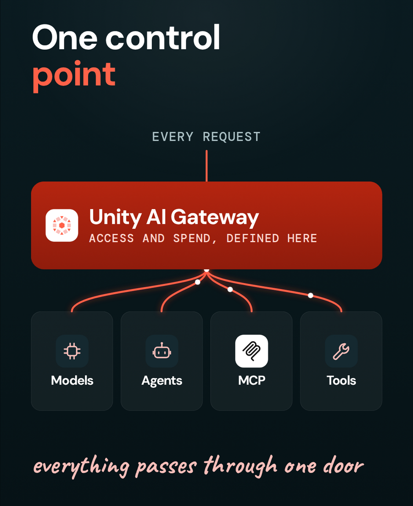
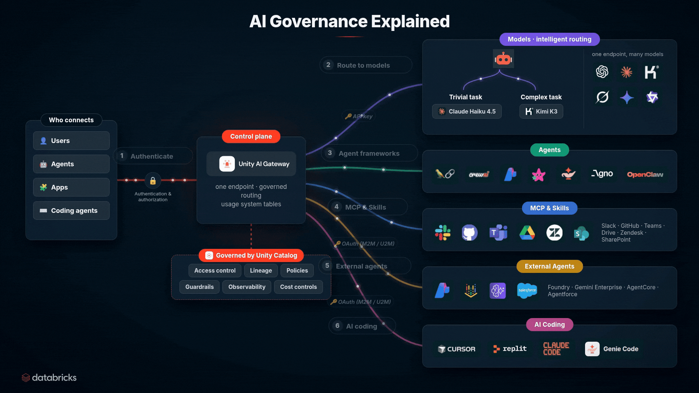

# 🌐 Lesson 3: How do you serve multiple models behind one Databricks endpoint and track their spend?

*Part of the **Agentic AI Explained** series · Lesson 3 of 10 · Last updated: August 27, 2026*

You create an endpoint in **Unity AI Gateway** and place several models behind it. Applications call the endpoint name, and the models underneath can be added, swapped, or rebalanced with no application change. Every request through the gateway is logged to Databricks system tables, so spend and usage are queryable **per model, per user, and per tool** from one place. You can query those tables in SQL, ask Genie in natural language, or have Genie build a dashboard.

<p align="center">
  
</p>

---

## 🎯 What this solves

The more AI tools an organization adds, the harder one simple question becomes: **how much are we spending, and on what?**

A production environment ends up holding frontier models, open-weight models, external providers, coding agents, custom agents, MCP servers, enterprise tools, and several teams calling all of it. Without a shared layer, each integration carries its own credentials, access rules, budgets, logs, routing logic, guardrails, and monitoring. Answering the spend question means assembling numbers from every one of them.

A second problem sits alongside it. Models change on a weekly cadence. An application with a model name hard-coded into it has to be edited every time a better option appears, and every application has to be edited separately.

[**Unity AI Gateway**](https://docs.databricks.com/aws/en/ai-gateway) is a runtime control layer in front of models, agents, MCP servers, and tools. Access and spend get defined once, in one control plane.

---

## 🧩 Creating a multi-model endpoint

The endpoint is the **stable name** an application calls. What sits behind it is a configuration detail.

Because models change every week, I don't want to hard-code a model name. So instead of pointing an app at one provider, I put **several models behind one endpoint.**

| Layer | Changes how often | Who owns it |
|---|---|---|
| Endpoint name | Rarely | Platform team |
| Models behind the endpoint | Weekly or as needed | Platform team |
| Application code | Only on feature changes | Application team |

For the user this is completely seamless. They do not see which model runs underneath. When a new model is released, I update the endpoint and **nothing changes for anyone calling it.**

This also gives you a comparison surface. With several providers behind one endpoint, requests distribute across them, and the usage data that comes back tells you which performs better on your traffic.

---

## 🧪 Testing the endpoint

I test in the [**AI Playground**](https://docs.databricks.com/aws/en/large-language-models/ai-playground) with a question simple enough that every model answers it correctly, such as the capital of a country. Running it several times shows the requests distributing across the models behind the endpoint.

A trivial question isolates the routing behavior. Any variation you see is the endpoint distributing traffic, and none of it is the models disagreeing about the answer.

---

## 🗄️ Where does the usage data land?

Every request that passes through the gateway is logged to [**Databricks system tables**](https://docs.databricks.com/aws/en/ai-gateway/query-model-services). That is what turns spend from an estimate into a query.

```sql
SELECT
  event_time,
  service_type,
  service_name,
  endpoint_name,
  requester,
  usage.total_tokens AS total_tokens
FROM system.ai_gateway.usage
WHERE requester = current_user()
  AND event_time > now() - INTERVAL 7 DAYS
ORDER BY event_time DESC
LIMIT 50;
```

> ⏳ **Ingestion is not immediate.** Rows can take an hour or more to land, so a query run seconds after a request may return nothing. When demonstrating this, query a window that includes earlier activity. Check the current schema in the [Databricks documentation](https://docs.databricks.com/aws/en/ai-gateway/query-model-services) before depending on this query in production.

---

## 💬 Asking Genie for the same answer

Because the usage data sits in tables, you do not have to write SQL to work with it. I ask [**Genie**](https://docs.databricks.com/aws/en/genie/) which models I used recently and it returns the list in plain language.

I can also ask Genie to **build a dashboard** for my team or for myself.

The dashboard gives the breakdown that matters in a budget conversation.

| Dimension | Question it answers |
|---|---|
| Per model | Which models are consuming the budget |
| Per user | Who is generating the traffic |
| Per tool or application | Which workload is responsible |
| Per endpoint | Which access path was used |
| Over time | Whether spend is trending up |

This moves the organization from a rough idea of where AI spend is going to **seeing it broken down per model, per user, and per tool in one dashboard.**

---

## 🧰 What else does the gateway control?

Spend visibility gets attention first. The same layer carries several other controls.

- 🔑 **Access control.** Who may use a model, which endpoint is approved, which team is generating traffic, which credentials are used.
- 💸 **Budgets and rate limits.** Spend caps and alerts applied at the level that fits the environment, whether organization, team, application, agent, or individual user.
- 🔀 **Routing and fallback.** A stable access layer even when the model behind the endpoint changes, which enables traffic splitting, testing a replacement model with no application change, and fallback when a provider is unavailable. Smart routing from [Lesson 1](./01-smart-routing.md) sits on top of this model access layer.
- 🛡️ **Policies and guardrails.** Runtime evaluation of interactions between agents and models or tools, returning allow, ask, or deny. This matters most for agents, because tool calls create real side effects. ([Lesson 2](./02-agent-policies.md) is all about this.)
- 🔎 **Tracing and audit.** Which model handled a request, which user or agent generated it, how many tokens were used, what it cost, which tools were called, where latency occurred, and which policy fired.

---

## 🏛️ Unity Catalog and Unity AI Gateway

The two layers do different jobs. [**Unity Catalog**](https://docs.databricks.com/aws/en/data-governance/unity-catalog/) defines and governs the assets and permissions across data, models, agents, MCP servers, tools, and skills. **Unity AI Gateway** applies that governance in the runtime path, on the actual request, and records what happened.

<p align="center">
  
</p>

Governance is not a wall you put up once. It is the live picture above: every actor, every asset, and every request accounted for — which is exactly what the later lessons in this series build toward.

---

## 🧭 How the first three lessons fit together

- **Smart routing** decides *which model* handles the request.
- **Policies** decide *what the agent is permitted to do.*
- **Unity AI Gateway** provides the *shared runtime layer* for access, spend control, routing, and observability across all of it.

---

## 🧪 Your lab

1. Create an endpoint in Unity AI Gateway and add two or three models from different providers behind it.
2. Send the same simple question through the AI Playground several times and watch the distribution.
3. Wait for ingestion, then run the query above against `system.ai_gateway.usage`.
4. Ask Genie which models were used recently.
5. Ask Genie to build a dashboard showing cost per model and cost per user.

## 🏆 Your challenge

Point one of your own applications at the endpoint, replacing the direct provider SDK call, then swap the model behind the endpoint **while the application keeps running** and confirm nothing on the application side changed. Then add a spend cap at the level that fits your team and deliberately breach it in a test workload, so you know what your users see when the cap fires — before a real workload finds out for you.

---

## 👀 What to watch out for

- **System table ingestion lags.** Allow an hour or more before recent activity is queryable.
- **Check the schema.** System table columns can change. Confirm against the Databricks documentation before building a dashboard on a query.
- **Endpoint changes are silent to callers by design.** That is the benefit, and it also means you should record which models sat behind an endpoint during a given period, since the usage tables are what reconstruct that later.
- **Some capabilities may be in preview.** Confirm current availability in official documentation before production use.

---

## 🔗 Related lessons

- [Lesson 1: Smart routing](./01-smart-routing.md)
- [Lesson 2: Agent policies and budgets](./02-agent-policies.md)

---

[← Previous: Agent policies and budgets](./02-agent-policies.md)
