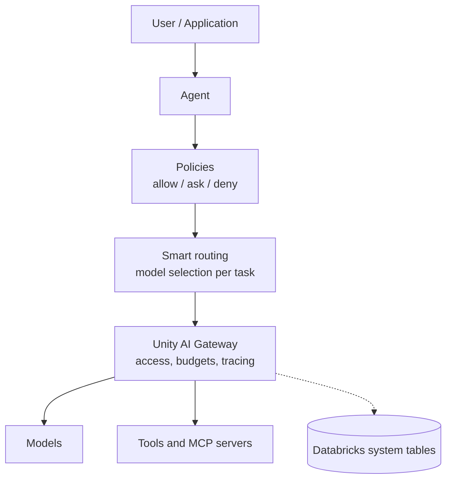

# Agentic AI Explained: Hands-On with Databricks

Companion guides for the **Agentic AI Explained** short-form video series by [Viktoria Semaan](https://www.linkedin.com/in/semaan/), Principal AI Evangelist at Databricks.

Each video is a fast explanation of one concept. Each guide here is the deeper version, with the configuration, the demo walkthrough, and the reasoning that a 90 second video has no room for. The series covers the runtime control layer that production agent systems need, built with Omnigent, Unity AI Gateway, and Unity Catalog on Databricks.

Written for software developers, solutions architects, and data scientists.

## How to follow along

Omnigent is open source and available at [omnigent.ai](https://omnigent.ai). The Databricks portions run on [Databricks Free Edition](https://www.databricks.com/learn/free-edition) where the feature is available there. Where a capability requires a paid workspace or is in preview, the relevant guide says so.

## The series

| # | Lesson | What it covers | Guide | Video |
|---|---|---|---|---|
| 1 | Smart Routing | Routing each task to the lowest cost capable model with the Omnigent intelligent model router | [Read](./01-smart-routing.md) | <!-- GAP --> |
| 2 | Agent Policies | Spend budgets, tool call limits, and the contextual session risk score | [Read](./02-agent-policies.md) | <!-- GAP --> |
| 3 | Unity AI Gateway | One endpoint across multiple model providers, and spend visibility through system tables and Genie | [Read](./03-unity-ai-gateway.md) | <!-- GAP --> |
| 4 | Agent Memory | | | |
| 5 | | | | |
| 6 | | | | |
| 7 | | | | |
| 8 | | | | |
| 9 | | | | |
| 10 | | | | |

<!-- GAP: lesson titles and one-line descriptions for lessons 4 through 10 -->

## The control layer

A model on its own is not a production system. An agent running against real tools and real money needs a runtime layer that decides:

- which model should handle each task
- what the agent is allowed to do
- when a human has to approve an action
- how much a user, team, agent, or application can spend
- how every model call and tool call is logged and traced

The first three lessons cover exactly that layer.

## Follow the series

- LinkedIn: [linkedin.com/in/semaan](https://www.linkedin.com/in/semaan/)
- Instagram: [@viktoria.semaan](https://www.instagram.com/viktoria.semaan/)
- YouTube: <!-- GAP: series playlist URL -->

## Note

These guides are educational. Product interfaces and preview capabilities change, so verify current Databricks and Omnigent documentation before using any example in production.

## License

[MIT](./LICENSE)
